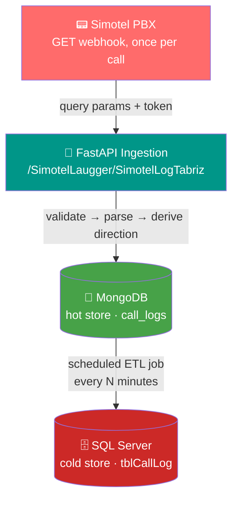

<div align="center">

# 📞 Telephone Call Log Service

**Every call, logged. No exceptions.**

Captures every phone call that touches the company's phone system — internal, inbound, and outbound — as structured metadata, in real time, straight from the Simotel PBX.

[](https://www.python.org/)
[](https://fastapi.tiangolo.com/)
[](https://www.mongodb.com/)
[](https://www.microsoft.com/sql-server)
[](./tests)
[]()

</div>

---

## 🧭 Overview

Simotel (the company's Asterisk-based PBX) pushes a webhook the instant every call ends — no polling, no missed events by design. This service catches that webhook, makes sense of it, and writes it into a two-tier store: a fast MongoDB layer for quick lookups, and a permanent SQL Server archive for reporting and audits. Same battle-tested pattern as the company's existing MEAS II audit log service.

**No audio is ever stored.** Metadata only — numbers, timestamps, duration, disposition, direction.

📄 Deeper reading: [`PROJECT_REPORT.md`](./PROJECT_REPORT.md) (full design rationale & findings) · [`TESTING_AND_DEPLOYMENT.md`](./TESTING_AND_DEPLOYMENT.md) (stage-by-stage runbook)

---

## ✨ Features

| | |
|---|---|
| 🎯 **Complete coverage** | Every call — internal, inbound external, outbound external — no scope gaps |
| ⚡ **Fast ingestion** | Async FastAPI endpoint, validate → parse → insert, immediate response |
| 🔐 **Token-secured** | Constant-time API key validation, never logged or echoed |
| 🧠 **Smart direction detection** | Uses Simotel's own confirmed `type` field, with a numbering-plan fallback |
| 🔁 **Idempotent by design** | Duplicate deliveries are safe no-ops — no accidental double-logging |
| 🗄️ **Two-tier storage** | MongoDB for speed, SQL Server for permanence, synced automatically |
| 🧪 **Tested against real data** | 17 tests, including real Simotel payload examples, not just guesses |

---

## 🏗️ Architecture



Both the API and both databases run on the same server (`192.168.1.18`), alongside the existing audit log service.

---

## 🧩 Call Direction Logic

Direction is derived from Simotel's own `type` field — a documented, confirmed-complete enum — not guesswork:

| Simotel `type` | → Stored `direction` |
|:---:|:---:|
| `local` | 🏢 `internal` |
| `incoming` | 📥 `inbound_external` |
| `outgoing` | 📤 `outbound_external` |
| `feature` | ⭐ `feature` |
| *missing / `no defined`* | 🔢 falls back to number-length heuristic |

> **Real bug this caught:** a call to a 2-digit extension (`dst="66"`) would've been misclassified as external by number-length alone. `type="local"` correctly calls it `internal`. This is why `type` is the primary signal, not the fallback.

---

## 🚀 Quick Start

```bash
git clone https://github.com/MahdiFarsad/telephone-log-service
cd telephone-log-service
pip install -r requirements.txt
cp .env.example .env    # then edit with real values — see Configuration below
uvicorn app.main:app --reload
```

> 💡 `pyodbc` needs system ODBC libraries to build. If it fails locally, remove it from `requirements.txt` — it's only needed for the SQL Server sync job, not the ingestion endpoint itself.

---

## 🧪 Testing

```bash
pip install httpx pytest pytest-asyncio mongomock-motor
pytest tests/ -v
```

```
17 passed ✅
```

Covers token validation, payload parsing, direction derivation across **all four confirmed `type` values**, duplicate-delivery idempotency, and both real payload examples supplied by the team — not just synthetic test data.

---

## ⚙️ Configuration

<details>
<summary><strong>Click to expand full <code>.env</code> reference</strong></summary>

| Variable | Purpose | Must change before real use? |
|---|---|:---:|
| `SIMOTEL_API_TOKEN` | Must match Simotel's configured webhook token | ✅ |
| `SIMOTEL_TOKEN_PARAM_NAME` | Query param the token arrives in | confirmed: `api_key` |
| `MONGO_URI` | Hot store connection string | ✅ |
| `MONGO_DB_NAME` / `MONGO_COLLECTION` | Hot store naming | check for collisions |
| `SQLSERVER_CONN_STR` | Cold store connection string | ✅ |
| `SQLSERVER_TABLE` | Cold store table name | matches `sql/create_table.sql` |
| `ETL_INTERVAL_MINUTES` / `ETL_BATCH_SIZE` | Sync job tuning | optional |
| `EXTENSION_MIN_LENGTH` / `EXTENSION_MAX_LENGTH` | Fallback direction heuristic range | low priority — `type` covers this now |
| `HOT_STORE_RETENTION_DAYS` | Suggested hot-store retention window | optional |

</details>

---

## 📦 Project Structure

```
app/
├── main.py             → FastAPI app + the webhook endpoint
├── config.py           → all settings, loaded from .env
├── direction.py        → call direction derivation logic
├── security.py         → API token validation
├── models/call_log.py  → request model + stored record shape
├── db/
│   ├── mongo.py        → MongoDB (hot store) access
│   └── sql_server.py   → SQL Server (cold store) access
└── jobs/etl.py          → scheduled Mongo → SQL Server sync

sql/create_table.sql   → SQL Server table DDL
capture.py              → standalone tool to capture a real Simotel payload
tests/                  → 17 tests, no real database required to run them
```

---

## 🌐 Deployment

Runs on `192.168.1.18`, alongside the existing audit log service:

1. **Provision** — new MongoDB database + new SQL Server database/schema, separate from the audit log's own data. Run `sql/create_table.sql`.
2. **Configure** — real `.env` values on the server. Never commit this file.
3. **Run reachable on the network:**
   ```bash
   uvicorn app.main:app --host 0.0.0.0 --port <configured port>
   ```
4. **Auto-start** — set up as a systemd service (Linux) or Windows Service.
5. **Verify** — confirm Simotel's webhook settings point at this tested path, then send one real call and check it lands in both stores.

Full stage-by-stage guide: [`TESTING_AND_DEPLOYMENT.md`](./TESTING_AND_DEPLOYMENT.md)

---

## 📋 Known Open Items

None of these block deployment — tracked in full in [`PROJECT_REPORT.md`](./PROJECT_REPORT.md#8-whats-confirmed-vs-still-open):

- ❓ Whether `billsec` is talk time or ring time — Simotel's own docs are self-contradictory on this
- ❓ Simotel PBX's actual IP address (for firewall rules only)
- ❓ Timezone of `starttime`/`endtime` — Simotel defaults to UTC, not yet explicitly confirmed for this install

---

<div align="center">

Built on the same architecture as the MEAS II audit log service · Metadata only, no audio ever stored

</div>
